# Деталізований planning report: план реалізації Extensia 0.1.0

Status: accepted
Created: 2026-07-09
Related Task: `memory/tasks/plan/TASK-07.26-0003-plan-extensia-v0-1-0-delivery/index.md`
Related Research Artifact: `memory/tasks/plan/TASK-07.26-0003-plan-extensia-v0-1-0-delivery/research/RSCH-001.md`
Report Type: planning

## 1. Питання і підсумкова рекомендація

Мета planning research — перетворити фазовий roadmap Extensia на керовану програму реалізації release `0.1.0`, де найближчі Phase 1-2 мають task-ready backlog, Phase 3 деталізована до write-oriented vertical slices і correctness gates, а Phase 4-7 лишаються чесними rolling-wave work packages без передчасного заморожування draft contracts.

Рекомендована програма складається із семи delivery waves після завершеної Phase 0. Кожна суттєва хвиля має однаковий цикл:

```text
дослідження / дизайн / планування
  -> реалізація observable vertical slice
  -> ризик-орієнтована стабілізація
  -> незалежний аудит і memory sync
  -> людський review gate
```

Критичний шлях проходить через tooling і domain contracts, перевірену IoC composition, read-only public slice, journal-backed Resource writes на deterministic fake driver, затверджений concrete storage protocol, concrete durable driver, read-model synchronization, extension contracts і release stabilization. Concrete storage, hooks, lazy completeness та public compatibility не можна реалізовувати до відповідних design gates.

## 2. Вхідні рішення користувача

Planning baseline без зміни сенсу включає такі рішення:

- implementation використовує exact dependency `@sagifire/ioc@0.0.2` як internal composition layer;
- TypeScript compiler settings, build tool, test runner, package exports і source/package layout для Node.js 24 ESM library обираються в цьому research із явним обґрунтуванням;
- `IDString`, числовий `Timestamp` і readonly DTO snapshots визначаються в цьому research; `Timestamp` має numeric public і serialized contract;
- кожна фаза, work package, vertical slice і task proposal отримує мінімальний рівень інтелекту агента `низький / середній / сильний / екстремальний`.

Ці рішення не стабілізують інші conceptual signatures зі source specifications.

## 3. Метод, джерела і достовірність

### 3.1. Джерела

Внутрішні sources прочитані як UTF-8:

- `memory/state.md`, `memory/product/vision.md`, `memory/product/requirements.md`, `memory/product/roadmap.md`;
- `memory/domain/glossary.md`, `memory/domain/target/model.md`, `memory/domain/rules.md`, `memory/domain/open-questions.md`;
- `memory/technical/architecture.md`, `memory/technical/stack.md`, `memory/technical/rules.md`, `memory/technical/source-specifications.md`, `memory/technical/open-questions.md`;
- ADR-0002, ADR-0003, ADR-0004 і ADR-0005;
- три authoritative draft source specifications у `memory/references/extensia-v2/`;
- `package.json` і фактичний склад root workspace;
- правила autonomous research із Project Memory і пакета `pdadm-mvp-reglament`.

Зовнішні primary sources:

- exact npm tarball [`@sagifire/ioc@0.0.2`](https://registry.npmjs.org/@sagifire/ioc/-/ioc-0.0.2.tgz), його `package.json`, README, changelog і всі public `.d.ts`;
- [TypeScript module reference](https://www.typescriptlang.org/docs/handbook/modules/reference) і npm metadata конкретних compiler versions;
- [Node.js 24 TypeScript support](https://nodejs.org/docs/latest-v24.x/api/typescript.html), [package exports](https://nodejs.org/docs/latest-v24.x/api/packages.html) і [test runner](https://nodejs.org/docs/latest-v24.x/api/test.html);
- [Vitest 4 guide](https://vitest.dev/guide/) і [coverage guide](https://vitest.dev/guide/coverage.html);
- [ESLint flat config](https://eslint.org/docs/latest/use/configure/configuration-files) та exact npm metadata tooling packages.

### 3.2. Рівні достовірності

| Клас джерела | Достовірність для планування | Обмеження |
|---|---|---|
| Явні рішення користувача й accepted requirements | висока | Не визначають усі exact signatures. |
| Accepted ADR-0002/0003 і source policy | висока | ADR-0004/0005 були `proposed` під час research; прийняті через FIX-004 2026-07-10. |
| Exact package contents `@sagifire/ioc@0.0.2` | висока | Runtime integration ще не перевірена executable tests. |
| Authoritative draft specifications | середня | Conceptual examples не є stabilized public API. |
| Npm/tooling snapshot на 2026-07-09 | середня | Версії змінюються; exact pins треба оновлювати лише окремою dependency task. |
| Phase 4-7 estimates | низька/середня | Залежать від ще не прийнятих storage, recovery, API і compatibility decisions. |

### 3.3. Припущення планування

- Package лишається одним ESM-only package `@sagifire/extensia` з `engines.node >=24`; dual CJS delivery не планується.
- `@sagifire/ioc` є direct runtime dependency, а не peer dependency і не public application contract.
- До Phase 4 correctness перевіряється deterministic fake driver; це не дозволяє називати state durable на реальному storage.
- Один storage-level writer є baseline; distributed fine-grained multi-writer не входить у `0.1.0`.
- Calendar estimates відсутні: effort є відносним розміром, а не строком.
- Product/Domain/Technical memory не змінюється цим report без approval відповідних `FIX-*`.

## 4. Перевірка baseline і знахідки

### 4.1. Узгоджені частини baseline

- Усі 37 requirements мають `accepted` status і покривають identity, domain, facade-first API, internal IoC, Core-driven writes, journal publication, recovery, synchronization та quality boundaries.
- `package.json` узгоджений із release identity: `@sagifire/extensia@0.1.0`, ESM, Node.js `>=24`.
- Product vision, target domain model, technical architecture і три source specifications узгоджені щодо in-process nature, `Resource` aggregate, Storage Driver source of truth, facade-first boundary та immutable composition.
- Current implementation state чесний: production runtime, tests, build, public API і drivers відсутні.
- Runtime і API draft documents послідовно забороняють service locator, direct write bypass і publication index state до commit.

### 4.2. Суперечності та застарілі статуси на момент research

| ID | Знахідка | Вплив | Рекомендована дія |
|---|---|---|---|
| F-01 | Phase 0 у `product/roadmap.md` має `in review`, хоча TASK-07.26-0002 прийнята й `done`. | Roadmap неправильно показує readiness. | `FIX-001`: Phase 0 -> `done`, наступний gate -> Phase 1. |
| F-02 | `state.md` на момент створення задачі каже, що active tasks немає; під час виконання TASK-0003 це операційно застаріло. | Не змінює product design, але порушує current-state navigation. | Оновити `state.md` разом із прийнятим planning result, не підміняючи task progress. |
| F-03 | ADR-0004 і ADR-0005 мають `proposed`, хоча відповідні requirements уже accepted і technical rules трактують boundaries як baseline. | Нечіткий authority level facade/Core consistency decisions. | Окремий `FIX-004`: запропонувати `accepted` або явно лишити як gate; recommendation — `accepted` для суті, exact signatures лишити draft. |
| F-04 | Runtime source має stale self-reference на видалений non-IoC filename. | Навігаційний ризик, але source policy його нейтралізує. | Не редагувати relocated source; зберегти redirect у `technical/source-specifications.md`. |
| F-05 | Draft IoC sketches не відображають обмеження actual package щодо async multi contributions. | Можлива хибна architecture implementation. | У Phase 1 зберігати contributions синхронними descriptors/factories; async init виконувати Extensia lifecycle. |
| F-06 | `domain/open-questions.md` ще вважає scalar/DTO contracts невирішеними. | Блокує чисту Phase 1 реалізацію. | `FIX-003` після approval цього report. |
| F-07 | `technical/stack.md` і open questions не містять обраного tooling baseline та результату IoC conformance. | Phase 1 не task-ready без canonical sync. | `FIX-002` після approval цього report. |
| F-08 | `.gitignore` навмисно ігнорує `package-lock.json`, тоді як selected npm baseline вимагає committed lockfile. | Reproducible dependency graph неможливий без policy change. | BP1-01 має оновити `.gitignore` разом із manifest/tooling, після approval FIX-002. |

Стан після fixation application 2026-07-10:

- F-01/F-02 закриті FIX-001; F-03 закрита FIX-004; F-06 закрита FIX-003; F-07 закрита FIX-002.
- F-05 закрита на рівні canonical decision ADR-0006, але executable conformance tests лишаються BP1-03.
- F-04 лишається контрольованим navigation risk із canonical redirect; F-08 лишається implementation work BP1-01, бо package files не входили до fixation scope.

### 4.3. Відстеження requirements до хвиль

| Група requirements | Відповідальні хвилі | Доказ для release |
|---|---|---|
| Ідентичність і позиціювання | P1, P7 | metadata запакованого package, відсутність server/API leak для IoC |
| Інваріанти Resource і домену | P1, P2, P3 | тести чистих contracts, read slice, матриця write invariants |
| Інваріанти Asset | P4 | матриця Asset/upload на concrete driver |
| Public API і facades | P2, P6, P7 | read-only scenario, extension scenarios, API report |
| Composition і lifecycle | P1, P2, P6 | graph diagnostics, startup rollback, reverse cleanup |
| Write, journal і recovery | P3, P4 | failure injection на fake, crash/restart на concrete driver |
| Greedy/lazy і sync | P5 | completeness contracts, cursor/order, multi-instance tests |
| Якість і compatibility | усі хвилі, P7 | стабілізація кожної хвилі, незалежні аудити, матриця packed-consumer |

## 5. Класифікація невизначеностей

`blocking now` означає blocker для найближчої implementation task; `planned design gate` — робота не блокує попередні хвилі, але блокує власний consumer slice; `deferred/experimental` — не входить у baseline `0.1.0` або не стабілізується зараз.

| ID | Категорія | Owner stage | Стан / рішення |
|---|---|---|---|
| U-01 exact IoC API | blocking now | P1-WP3 | Закрито research: `0.0.2` придатна з адаптаціями з section 6. |
| U-02 tooling/package baseline | blocking now | P1-WP1 | Закрито recommendation з section 7; canonical sync застосовано через FIX-002 2026-07-10. |
| U-03 `IDString` / `Timestamp` / readonly DTO | blocking now | P1-WP2 | Закрито recommendation з section 8; canonical sync застосовано через FIX-003 2026-07-10. |
| U-04 exact facade/result/error contract | planned design gate | BP2-01 перед P2-WP2/P2-WP3 | Не заморожувати methods із draft. |
| U-05 config `plugins` vs `extensions`, registry ownership | planned design gate | P2-DG1/P6-DG1 | Phase 1 використовує internal normalized descriptors без public promise. |
| U-06 operation/journal/lock/recovery contract | planned design gate | P3-DG1 | Блокує write success, не блокує read-only slice. |
| U-07 concrete storage layout/atomic protocol | planned design gate | P4-DG1 | Блокує concrete driver; fake не є доказом durability. |
| U-08 lazy completeness і sync cursor | planned design gate | P5-DG1 | Блокує global lazy queries та multi-instance claims. |
| U-09 hook payloads/ordering/optional plugin policy | planned design gate | P6-DG1 | Блокує stable plugin ecosystem. |
| U-10 public compatibility policy | planned design gate | P7-WP1 | Блокує release freeze. |
| U-11 Advanced IoC Extension Module API | deferred/experimental | P6-DG2 | Recommendation: не включати в public `0.1.0`; official/internal modules достатні. |
| U-12 dynamic extensions after startup | deferred/experimental | post-0.1.0 | Не реалізовувати. |
| U-13 direct external storage reconciliation | deferred/experimental | post-0.1.0 / driver-specific | Journal path лишається correctness baseline. |
| U-14 distributed fine-grained multi-writer | deferred/experimental | post-0.1.0 research | Один storage writer лишається baseline. |
| U-15 performance budgets | planned design gate | P5 stabilization, P7 release | Визначити після executable baseline і representative fixtures. |
| U-16 Resource `updated_at` propagation | planned design gate | P3-DG2 перед P3-VS4/VS5 | Блокує Mark/KV і delete/restore semantics; власні metadata P3-VS2 використовують окремо погоджену вузьку policy. |
| U-17 Resource delete/visibility/restore | planned design gate | P3-DG2 перед P3-VS5 | До gate успішний delete/restore не реалізується. |
| U-18 `locked`/`hidden` integrations | planned design gate | P6-DG1 | До extension contract ці поля лишаються даними без неявної plugin behavior. |
| U-19 Resource field validation | planned design gate | P3-DG1 перед P3-VS1/VS2/VS3 | Потрібні точні empty/range/parent rules; P1 не вигадує їх у pure validators. |
| U-20 sibling `order_index` normalization | planned design gate | P3-DG2 перед P3-VS3/VS5 stabilization | P3-VS3 не проходить gate без погодженої insert/move policy; delete normalization входить у P3-VS5. |
| U-21 Asset relation/primary lifecycle | planned design gate | P4-DG2 перед P4-VS2 | Охоплює cross-resource `derived_from` і delete/move primary Asset. |
| U-22 Asset field та URL validation | planned design gate | P4-DG2 перед P4-VS2/VS3 | Блокує stabilized Asset metadata й upload contracts. |
| U-23 `Asset.data` limits/schema compatibility | planned design gate | P4-DG2 для limits; P7-WP1 для versioning | JSON-safe object/null shape закрито U-03; exact limits і schema evolution не стабілізуються у P1. |
| U-24 internal Asset initial upload phase | planned design gate | P4-DG2 перед P4-VS3 | Визначає, чи дозволений atomic ready-file path поруч зі staged upload. |
| U-25 Mark/KV names, normalization і size limits | planned design gate | P3-DG2 перед P3-VS4 | До gate немає public write success для Mark/KV. |
| U-26 `setMarks`/`setKV` replace vs patch | planned design gate | P3-DG2 перед P3-VS4 | Визначає write set, lock scope та result semantics. |
| U-27 DTO serialization schema versioning | planned design gate | P7-WP1 | Readonly/detached JSON shape закрито U-03; versioning не блокує internal P1 contracts, але блокує release freeze. |

## 6. Відповідність `@sagifire/ioc@0.0.2`

### 6.1. Фактична surface

| Потреба Extensia | Фактичний contract `0.0.2` | Висновок |
|---|---|---|
| Typed stable tokens | `token`, `multiToken`, `contributionToken`, `namespace` | Підтримано; IDs мають бути static/namespaced. |
| Explicit modules | `defineModule({ id, requires, provides, setup })` | Підтримано; `provides.kind` обов’язковий, cardinality explicit. |
| Composition root bindings | `composer.use`, `bind`, `add`, `adapt(...).from(...).using(...)` | Підтримано; external driver binding і consumer-owned adapters природні. |
| Graph validation | `validate`, diagnostics для missing ports, cycles, duplicate/cardinality/adapter errors | Підтримано й достатньо для IoC graph, але extension graph лишається Extensia-level. |
| Immutable runtime boundary | async `compose()` -> `ComposedRuntime`; exported capabilities only; private access errors | Підтримано. Runtime mutation API після compose немає. |
| Scopes | `createScope`, `withScope`, `scopeValue`, `scopeMultiValue`, child scopes | Підтримано для explicit operation scope. |
| Async providers/resources | `toAsyncFactory`, `toAsyncResource`, `getAsync`, disposal | Підтримано для single providers/resources. |
| Multi contributions | module/composer `add`, `getAll`, cardinality validation | Підтримано лише для synchronous values/factories. |
| Lifecycle/disposal | runtime/scope disposal для initialized resources | Частково: Extensia startup/stop ordering і rollback policy мають бути власним Runtime Controller. |
| Inspection/diagnostics | `inspect`, `getGraph`, `formatDiagnostics`, safe metadata | Підтримано; Extensia нормалізує diagnostics і не віддає raw providers. |
| Test composition | fresh composer, alternative modules/bindings до compose | Підтримано; спеціального mutable override після compose немає і не потрібно. |

### 6.2. Обов’язкові адаптації

1. Facade/hook/lifecycle catalogs реєструються як synchronous descriptor contributions. Async creation і init виконуються після collection у Extensia Runtime Controller; не проектувати `getAllAsync()`, якого немає.
2. Порожній required multi catalog не повинен випадково провалювати composition: dependency робиться optional або system module гарантує щонайменше одну contribution.
3. IoC disposal не замінює Extensia stop policy. Controller закриває intake, чекає/cancel active operations, зупиняє extensions і driver, після чого Composition Root викликає `runtime.dispose()` у `finally`.
4. Extension graph validation окрема від IoC graph validation; facade/plugin names не перетворюються на випадкові raw tokens.
5. Test harness будує fresh composer. Duplicate bindings не використовуються як patching mechanism.
6. Module `setup()` реєструє providers і не запускає runtime side effects, навіть якщо contract технічно дозволяє async setup.

### 6.3. Verdict

`@sagifire/ioc@0.0.2` не створює blocker для Extensia composition root. Специфікації потребують точкового уточнення sketches, але не зміни accepted architecture. Version має бути exact direct dependency `"@sagifire/ioc": "0.0.2"`; raw runtime і tokens не експортуються з Extensia public root.

## 7. Baseline інструментів, збірки, тестів і package

### 7.1. Порівняння варіантів

| Область | Варіант | Переваги | Недоліки | Рішення |
|---|---|---|---|---|
| Build | `tsc` emit | Native `.js`/`.d.ts`, NodeNext semantics, без bundling, прозорі stack traces та module boundaries | Не мінімізує й не bundle-ить | Обрати. Extensia — Node library, bundling не потрібен. |
| Build | `tsup`/esbuild | Швидко, зручно для dual formats | Може приховати invalid imports/exports, tree/bundle behavior і CJS complexity | Не використовувати для `0.1.0`. |
| Build | Rollup | Максимальний контроль | Зайва complexity без browser/one-file target | Не використовувати. |
| Tests | Node `node:test` | Нуль dependencies, реальний Node runtime | Coverage у Node 24 experimental; module mocking ранній; direct TS execution залежить від minimum minor та ignores tsconfig | Не обирати як primary; використати для packed smoke за потреби. |
| Tests | Vitest 4 | Stable TS/ESM transform, mocks/timers, projects, V8 coverage, ergonomic failure matrix | Додає Vite/transformation layer | Обрати для unit/contract/integration/failure tests; packed tests запускають built JS у Node. |
| Compiler | TypeScript latest `7.0.2` | Найновіший compiler | На дату research `typescript-eslint@8.63.0` декларує peer `<6.1.0`; ecosystem gate не пройдений | Не обирати зараз. |
| Compiler | TypeScript `6.0.3` | Current stable line, сумісна з selected lint stack | Не latest major | Обрати exact pin; upgrade окремою task. |
| Public API checking | API Extractor | API report і declaration rollup | Поточний release використовує TS 5.9 internally; TS 6/7 compatibility треба перевіряти | Не робити Phase 1 hard dependency; spike у P7 або раніше. |
| Package checking | `publint` + `@arethetypeswrong/cli` + packed consumer | Перевіряє manifest/types/conditions фактичного tarball | Не замінює semantic API review | Обрати як package gate. |

### 7.2. Точний snapshot baseline

Версії нижче — exact recommendation станом на 2026-07-09, не автоматичний дозвіл на install у цій planning task:

- runtime: `@sagifire/ioc@0.0.2`;
- compiler/types: `typescript@6.0.3`, `@types/node@24.12.0`;
- tests: `vitest@4.1.10`, його прямий peer `vite@8.1.4`, `@vitest/coverage-v8@4.1.10`;
- lint/format: `eslint@10.6.0`, `@eslint/js@10.0.1`, `typescript-eslint@8.63.0`, `prettier@3.9.5`;
- package checks: `publint@0.3.21`, `@arethetypeswrong/cli@0.18.4`.

Package manager baseline — npm із committed `package-lock.json`, exact direct pins і `npm ci` у CI. Нова dependency version не потрапляє в package випадково через floating range.

### 7.3. Контракт компілятора

Build config має використовувати:

- `target: ES2024`, `lib: ["ES2024"]`;
- `module: NodeNext`, `moduleResolution: NodeNext`;
- `rootDir: src`, `outDir: dist`;
- `declaration`, `declarationMap`, `sourceMap`, `inlineSources`, `noEmitOnError`;
- `strict`, `exactOptionalPropertyTypes`, `noUncheckedIndexedAccess`, `useUnknownInCatchVariables`, `noImplicitOverride`, `noFallthroughCasesInSwitch`, `noUncheckedSideEffectImports`, `noPropertyAccessFromIndexSignature`;
- `verbatimModuleSyntax`, `isolatedModules`, `isolatedDeclarations`, `erasableSyntaxOnly`, `moduleDetection: force`, `forceConsistentCasingInFileNames`;
- `skipLibCheck: false`, `types: ["node"]`;
- relative source imports містять `.js` extension, який відповідає emitted ESM; TS path aliases, decorator transforms, runtime enums і namespace side effects не використовуються.

Окремий `tsconfig.build.json` включає тільки publishable `src/**`; tests type-check окремим no-emit config. Type checking і build є різними scripts, щоб tests не потрапляли в `dist`.

### 7.4. Source і test layout

```text
src/
  index.ts                 # єдиний root public entry
  domain/                  # scalars, DTO, pure validators
  composition/             # composition root, modules, internal tokens
  runtime/                 # controller, core, operations, locks, index, sync
  storage/                 # public driver contracts і internal adapters після gates
  api/                     # module, results, facades, plugins після gates
  testkit/
    index.ts               # окремий potential subpath entry, не root re-export
test/
  unit/
  contract/
  integration/
  failure/
  lifecycle/
  recovery/
  package/
dist/                      # тільки generated JS, d.ts і maps
```

Фізична структура може уточнюватися разом із slices, але boundary незмінний: public surface існує тільки через explicit entry files/exports. Внутрішні module files не мають wildcard subpath export. `testkit` може імпортувати контрольовані internal factories, але public root не імпортує testkit.

### 7.5. Package exports і artifacts

Phase 1 package спочатку експортує тільки root і `package.json`:

```json
{
  "type": "module",
  "main": "./dist/index.js",
  "types": "./dist/index.d.ts",
  "exports": {
    ".": {
      "types": "./dist/index.d.ts",
      "import": "./dist/index.js",
      "default": "./dist/index.js"
    },
    "./package.json": "./package.json"
  },
  "files": ["dist", "README.md", "LICENSE"],
  "sideEffects": false
}
```

`./testkit`, `./driver` і `./plugin` додаються лише після власного contract gate. Recommendation для `0.1.0`: `./testkit` як explicit experimental subpath у тому самому package, якщо Phase 3-6 підтвердять зовнішню потребу; він експортує high-level harness/fakes, але не Composed Runtime/private tokens. `./driver` потрібен до першого external driver contract. Internal paths ніколи не експортуються.

Build artifacts перевіряються через clean build, `npm pack --dry-run`, `publint`, `attw`, inspect tarball file list, install packed tarball у clean ESM consumer, runtime import і consumer TypeScript check. Тести source tree не є package smoke.

## 8. Базові contracts

### 8.1. `IDString`

Recommendation: canonical lowercase RFC 9562 UUID version 4 у hyphenated form, generated через Node `crypto.randomUUID()`. Причини:

- 122 random bits дають значно кращий collision margin, ніж draft 64-bit scheme з лише 32 random bits;
- немає окремої runtime dependency й custom bit protocol;
- format широко підтримується tooling, logs і storage adapters;
- ordering не закладається в ID; temporal/order semantics належать `Timestamp` або journal `sequence`.

Public contract є branded string, а serialized contract — звичайний canonical string:

```ts
declare const idStringBrand: unique symbol
export type IDString = string & { readonly [idStringBrand]: 'IDString' }
```

Runtime constructor/parser приймає `unknown`: тільки string у hyphenated UUID v4 form проходить validation; hex case може бути upper/lower на raw boundary і завжди нормалізується до lowercase. Non-hyphenated UUID, інші UUID versions і довільні strings відхиляються. Значення типу `IDString` уже canonical. DTO JSON містить lowercase string. Storage може використовувати ID як logical descriptor, але не як physical path без driver encoding. Existing/imported IDs іншого format потребуватимуть explicit adapter/migration, не неявного acceptance.

### 8.2. `Timestamp`

Recommendation: branded finite safe integer — кількість milliseconds від Unix epoch UTC.

```ts
declare const timestampBrand: unique symbol
export type Timestamp = number & { readonly [timestampBrand]: 'UnixEpochMilliseconds' }
```

Contract:

- одиниця: рівно 1 мілісекунда;
- serialization: JSON number, не string і не `Date`;
- precision: integer only, sub-millisecond data не приймається й не округлюється неявно;
- range: `Number.isSafeInteger(value)` і ECMAScript Date range `-8_640_000_000_000_000 <= value <= 8_640_000_000_000_000`;
- `Date -> Timestamp`: explicit validation `date.getTime()`; invalid date відхиляється;
- `Timestamp -> Date`: `new Date(value)` тільки presentation/integration helper;
- ISO strings дозволені лише у явно названому adapter/parser, не в canonical public або serialized DTO;
- wall-clock timestamp не є monotonic ordering primitive; journal ordering використовує окремий `sequence`.

Milliseconds обрані замість seconds, microseconds або nanoseconds, бо вони нативні для JS `Date`, достатні для resource metadata й повністю exact у заявленому range. Nanoseconds вимагали б `bigint`/string і суперечили numeric JSON contract.

### 8.3. Readonly DTO snapshots без mutable aliases

Canonical DTO properties є readonly на всіх рівнях; arrays мають `readonly T[]`, KV і metadata maps — readonly records. DTO містять лише JSON-compatible values:

```ts
export type JsonPrimitive = null | boolean | number | string
export type JsonValue =
  | JsonPrimitive
  | readonly JsonValue[]
  | { readonly [key: string]: JsonValue }
```

`undefined`, `Date`, `bigint`, functions, symbols, `NaN` і infinities у DTO заборонені. `Asset.data` звужується до readonly JSON object або `null`; exact size limits лишаються окремим validation gate.

Snapshot guarantee складається з двох правил:

1. public TypeScript surface є deeply readonly;
2. runtime повертає detached owned data без shared mutable references з Core/index/driver.

Runtime `Object.freeze()` не є compatibility guarantee: implementation може freeze snapshots для diagnostics/dev safety, але correctness не залежить від freeze. Навіть навмисна runtime mutation через type escape змінює лише локальний snapshot, не durable state. Stable field serialization і schema versioning проходять окремий Phase 7 gate; exact facade inputs/results не заморожуються цим рішенням.

## 9. Модель ітеративної роботи

### 9.1. Стандартна хвиля

| Частина | Entry criteria | Required artifacts / робота | Exit criteria |
|---|---|---|---|
| Research/design/planning | Owner requirement і consumer slice відомі; relevant open questions перелічені | task-local research/design, alternatives, chosen contract, memory fixation proposal за потреби | blocker questions закриті; decision approved; task-ready implementation scope |
| Vertical implementation | Contract approved; dependencies/gates пройдені; fake/fixture ready | observable scenario, мінімальні internal foundations, diagnostics, success і explicit failure path | scenario проходить через supported boundary; немає bypass/parallel architecture |
| Stabilization | Slice feature-complete | risk-oriented unit/contract/integration/failure/lifecycle/recovery/package checks; cleanup; architecture pressure; memory sync | blocker/high/medium findings закриті або винесені як approved blocker/follow-up |
| Human gate | Independent audit завершений; artifacts review-ready | review result, risks, next-wave proposal, fixation approvals | явне approve/change/reject; лише після цього деталізується/активується наступна wave |

### 9.2. Що вважається vertical slice

Vertical slice для Extensia — один observable scenario через Extensia Module або documented facade, який включає тільки потрібні domain/runtime foundations, повертає normalized result/diagnostics, має explicit failure behavior, lifecycle cleanup і tests на supported boundary. Внутрішній клас або набір interfaces без application-observable scenario не є slice.

Phase 1 має architecture-enabling slice: construction -> validated composition -> start -> safe state/diagnostics -> stop/dispose на fake driver. Phase 2 має перший product slice: start readonly runtime -> `query` читає Resource/tree snapshot -> `storage` write явно відхиляється -> stop, без journal writes і без IoC leak.

### 9.3. Горизонтальні foundations точно вчасно

1. Foundation створюється лише коли названа найближча vertical slice, що її споживає.
2. Реалізується найвужчий port/behavior, достатній для slice і accepted invariant; speculative methods не додаються.
3. Journal, Index, Registry, locks і Recovery не можна тимчасово обходити. Якщо invariant уже потрібен slice, мінімальна реальна foundation входить у той самий wave.
4. Fake реалізує production contract, а не parallel test-only architecture.
5. Розширення foundation відбувається після stabilization попереднього consumer slice.
6. Друга write path, service locator, direct index mutation або runtime patching автоматично зупиняє implementation для design/ADR.
7. Foundation без executable consumer наприкінці wave видаляється або явно переноситься; вона не оголошується completed architecture.

## 10. Карта залежностей, критичний шлях і паралельність

```mermaid
flowchart LR
  P0["P0: memory baseline прийнятий"] --> P1A["P1-WP1: tooling/package"]
  P1A --> P1B["P1-WP2: domain scalars/DTO"]
  P1A --> P1C["P1-WP3: відповідність IoC/composition"]
  P1A --> P1D["P1-WP4 + VS1: lifecycle harness"]
  P1B --> P1D
  P1C --> P1D
  P1D --> P2D["P2-DG1: мінімальний read API contract"]
  P2D --> P2A["P2-WP2: read-only Core/Index"]
  P2D --> P2B["P2-WP3: Facade Registry/default API"]
  P2A --> P2V["P2-VS1: public Resource read"]
  P2B --> P2V
  P2V --> P3D["P3-DG1: write/journal/recovery protocol"]
  P3D --> P3F["P3 foundations на deterministic fake"]
  P3F --> P3V1["P3-VS1: створення Resource"]
  P3V1 --> P3V2["P3-VS2: оновлення Resource"]
  P3V2 --> P3D2["P3-DG2: семантика order/delete/Mark/KV mutation"]
  P3D2 --> P3V3["P3-VS3: переміщення Resource"]
  P3D2 --> P3V4["P3-VS4: Mark/KV"]
  P3V3 --> P3V5["P3-VS5: delete/restore"]
  P3V4 --> P3V5
  P3V5 --> P4D["P4-DG1: concrete storage protocol"]
  P3V5 --> P4A["P4-DG2: Asset contracts"]
  P4D --> P4C["P4: concrete driver + Asset slices"]
  P4A --> P4C
  P4C --> P5D["P5-DG1: completeness/sync"]
  P5D --> P5["P5: greedy/lazy/sync slices"]
  P2V --> P6D["P6-DG1: extension contracts"]
  P3V1 --> P6D
  P6D --> P6["P6: plugin/custom facade/hook slices"]
  P5 --> P7["P7: стабілізація release"]
  P6 --> P7
```



Критичний шлях: `P0 -> P1-WP1 -> P1-WP2/3 -> P1-VS1 -> P2-DG1 -> P2-VS1 -> P3-DG1 -> P3-VS1/2 -> P3-DG2 -> P3-VS3/4 -> P3-VS5 -> P4-DG1/P4-DG2 -> P4 concrete durability -> P5 sync/completeness -> P7` плюс гілка `P6 -> P7`, що сходиться в P7.

Дозволена паралельність:

- До завершення P1-WP1 паралельно дозволені лише read-only підготовка fixtures та IoC conformance research. Після зеленого tooling gate P1-WP2 і P1-WP3 реалізуються паралельно; P1-VS1 чекає всі три work packages.
- Після P2-DG1 read-only Core/Index і Facade Registry можуть реалізовуватися паралельно; P2-VS1 інтегрує їх.
- У P3 lock/scope primitives, deterministic fake driver і journal model можуть реалізовуватися паралельно тільки після одного approved write protocol; Resource write slices лишаються послідовними.
- Після стабільного P3 create slice P6 design може стартувати паралельно з P4, але state-changing hooks не стабілізуються до перевіреного write pipeline.
- P5 і пізня P6 implementation можуть бути паралельними після своїх gates; P7 чекає обидві.

Заборонені передчасні залежності:

- Phase 2 query не залежить від journal/write success.
- Phase 3 не залежить від concrete filesystem layout.
- Phase 4 driver не визначає public facade signatures.
- Phase 6 plugins не отримують raw IoC/private storage APIs.
- Phase 7 не використовує release audit як заміну stabilization P1-P6.

## 11. Шкала складності, обсягу, ризику, невизначеності й упевненості

Кожна planning unit оцінюється окремо за шістьма вимірами від `0` до `3`:

- `DN` — новизна домену;
- `AC` — архітектурне зв'язування;
- `CD` — конкурентність і durability;
- `FR` — поверхня відмов і відновлення;
- `PC` — вплив на public compatibility;
- `TM` — матриця тестування.

Агрегований клас складності: `C1` = 0-4, `C2` = 5-8, `C3` = 9-13, `C4` = 14-18. Складність не дорівнює обсягу: `S/M/L/XL` описує відносний обсяг, ризик — ціну помилки, невизначеність — частку невирішених contracts, упевненість — надійність саме оцінки.

Відповідність рівнів агента:

- `низький`: C1, stable local contract, low blast radius;
- `середній`: C2, standard multifile work із bounded uncertainty;
- `сильний`: C3 або public/cross-cutting C2 із суттєвими trade-offs;
- `екстремальний`: C4 або correctness-critical durability/concurrency/recovery/compatibility work.

Ризик або вплив може підняти мінімальний рівень агента вище механічного класу складності. Аудитор має бути незалежним і щонайменше рівня виконавця; для public compatibility або durability gate рекомендується `екстремальний` аудитор.

## 12. Rolling-wave план Phase 1-7

### 12.1. Phase 1 — contracts і composition skeleton

| Одиниця | Результат і межа | Перевірка, стабілізація і gate | Оцінка -> клас; обсяг; ризик; невизначеність; упевненість | Агент / аудитор |
|---|---|---|---|---|
| P1-WP1 tooling/package | Відтворюваний ESM TypeScript package, точні pins і explicit exports; без runtime feature code | typecheck/build/lint/format; pack/publint/attw/чистий consumer; жодного CJS artifact | `1/2/0/1/2/3=9 -> C3`; M; середній; низька; висока | сильний / сильний |
| P1-WP2 domain kernel | `IDString`, `Timestamp`, readonly JSON-safe DTO і чисті validators; без Core/API methods | unit, property/boundary і type tests; JSON roundtrip; жодного mutable alias | `2/2/0/1/3/3=11 -> C3`; M; високий; низька; висока | сильний / сильний |
| P1-WP3 IoC composition | Точні `0.0.2` tokens/modules/adapters/cardinality/diagnostics; без public IoC leak | матриця failures graph validation, доступ до private providers, тести scope/disposal | `1/3/1/2/2/3=12 -> C3`; L; високий; середня; висока | сильний / сильний |
| P1-WP4 lifecycle/fakes | Runtime Controller, readonly fake driver binding, безпечні diagnostics і fresh-composition harness | policy start/stop/restart, startup rollback, reverse cleanup, гарантований dispose | `1/3/1/3/1/3=12 -> C3`; L; високий; середня; середня | сильний / сильний |
| P1-VS1 lifecycle scenario | Host створює module, composition валідована, start явно успішний або failed, inspection безпечний, stop виконує dispose | інтеграція через application boundary і smoke імпорту запакованого package | `1/3/0/3/2/3=12 -> C3`; M; високий; середня; середня | сильний / сильний |
| P1-STAB | Прибрати composition shortcuts, перевірити boundaries, синхронізувати пам'ять | усі P1 checks чисті; незалежний architecture review; human gate | `1/3/1/3/2/3=13 -> C3`; M; високий; низька; висока | сильний / сильний |

Gate P1: graph валідований до startup і незмінний після compose; private providers недоступні публічно; failure під час start очищає всі ініціалізовані ресурси; точний tarball package імпортується на Node 24; domain contracts проходять boundary tests.

### 12.2. Phase 2 — read-only Resource slice та API foundation

| Одиниця | Результат і межа | Перевірка, стабілізація і gate | Оцінка -> клас; обсяг; ризик; невизначеність; упевненість | Агент / аудитор |
|---|---|---|---|---|
| P2-DG1 minimal read API | Погодити тільки Resource query, explicit storage failure, result/error DTO і registry ownership, потрібні VS1 | review alternatives, type/API snapshot, без freeze майбутніх methods | `2/3/0/2/3/3=13 -> C3`; M; високий; середня; середня | сильний / екстремальний |
| P2-WP2 read Core/Index | Readonly driver -> Core read port -> мінімальний Resource/id/children index; без journal/write path | unit/contract tests для missing/invalid/tree projection і мінімального greedy load | `2/3/0/2/2/3=12 -> C3`; L; високий; середня; середня | сильний / сильний |
| P2-WP3 facade mechanism | Єдиний Facade Provider/Registry mechanism; system `query`/`storage`; freeze і reserved names | тести duplicates/reserved/dependency/freeze/startup rollback | `1/3/0/3/3/3=13 -> C3`; L; високий; середня; середня | сильний / екстремальний |
| P2-VS1 Resource read | Public query повертає detached readonly Resource/tree snapshot; storage write повертає явний unsupported/readonly failure | інтеграція через Extensia Module, нуль journal writes, raw IoC недоступний | `2/3/0/3/3/3=14 -> C4`; L; високий; середня; середня | екстремальний / екстремальний |
| P2-STAB | Стабілізація API boundary, lifecycle, package і пам'яті | contract/integration/lifecycle/package tests, architecture pressure і незалежний audit | `1/3/0/3/3/3=13 -> C3`; M; високий; низька; висока | сильний / екстремальний |

Gate P2: жодна command не повертає success; queries ніколи не додають journal entry; DTO detached/readonly; registry frozen до ready; public surface не містить Core/IoC token lookup.

### 12.3. Phase 3 — перші Resource write slices із journal

| Одиниця | Результат і межа | Перевірка, стабілізація і gate | Оцінка -> клас; обсяг; ризик; невизначеність; упевненість | Агент / аудитор |
|---|---|---|---|---|
| P3-DG1 write protocol | Точні operation plan, lock order, journal phases/sequence, fake transaction/staging, recovery matrix і error taxonomy | review моделі та таблиця state transitions/failures; без concrete layout | `2/3/3/3/2/3=16 -> C4`; L; критичний; висока; середня | екстремальний / екстремальний |
| P3-WP1 locks/scopes/engine | Детерміновані local locks, operation scope, intake/cancel policy і pipeline skeleton | concurrency/unit/lifecycle tests; locks/scope завжди звільняються | `2/3/3/3/1/3=15 -> C4`; L; критичний; середня; середня | екстремальний / екстремальний |
| P3-WP2 fake full driver/journal/recovery | Детермінований contract-faithful full fake з failures у cut points, committed publication і startup recovery | contract і failure-injection matrix на кожній pipeline boundary | `2/3/3/3/1/3=15 -> C4`; XL; критичний; середня; середня | екстремальний / екстремальний |
| P3-VS1 create Resource | `storage.create` -> journal commit -> local index -> `query` read-back | readonly rejection, duplicate/validation, commit/index/hook ordering, injected crash | `2/3/3/3/3/3=17 -> C4`; L; критичний; середня; середня | екстремальний / екстремальний |
| P3-VS2 update Resource | Explicit patch змінює власні fields через той самий pipeline; timestamp policy погоджена для цих fields | serialization concurrent updates, failure rollback, post-commit warning | `2/3/3/3/3/3=17 -> C4`; M; критичний; середня; середня | екстремальний / екстремальний |
| P3-DG2 remaining Resource mutation semantics | Вирішити propagation `updated_at`, visibility/propagation/restore для soft delete, sibling order normalization, replace-vs-patch для `setMarks`/`setKV` і relevant limits | domain/API alternatives, матриця invariants/states, погоджена fixation | `3/3/2/3/3/3=17 -> C4`; L; критичний; висока; низька | екстремальний / екстремальний |
| P3-VS3 move Resource | Зміна parent/order із cycle prevention і locking усіх affected entities за погодженою P3-DG2 sibling-order policy | матриця tree/cycle/sibling/concurrency/failure/recovery | `3/3/3/3/3/3=18 -> C4`; L; критичний; висока; низька | екстремальний / екстремальний |
| P3-VS4 Mark/KV write-read | Explicit Mark і KV commands через той самий operation pipeline із query/read-back та index update | тести duplicate/range/namespace/replace-patch/concurrency/failure/recovery | `3/3/3/3/3/3=18 -> C4`; L; критичний; висока; низька | екстремальний / екстремальний |
| P3-VS5 Resource delete/restore | Реалізувати погоджену policy soft-delete/visibility/propagation або явно виключити restore, якщо так вирішить gate | матриця tree/assets/queries/repeat-delete/concurrency/failure/recovery | `3/3/3/3/3/3=18 -> C4`; L; критичний; висока; низька | екстремальний / екстремальний |
| P3-STAB | Audit усієї write model на fake driver | randomized schedules там, де вони детерміновані; повна failure matrix, recovery, leak/cleanup і architecture audit | `2/3/3/3/3/3=17 -> C4`; L; критичний; середня; середня | екстремальний / екстремальний |

Gate до concrete storage: успішні fake operations для Resource metadata/tree/delete, Mark і KV мають рівно одну committed publication; кожний failure cut лишає останній committed state відновлюваним; index ніколи не випереджає commit; readonly відхиляє operation до mutation; другого write path немає. Успішні fake tests необхідні, але не доводять реальну durability.

### 12.4. Phase 4 — Assets і concrete durable Storage Driver

| Одиниця | Результат і межа | Перевірка, стабілізація і gate | Оцінка -> клас; обсяг; ризик; невизначеність; упевненість | Агент / аудитор |
|---|---|---|---|---|
| P4-DG1 concrete protocol | Обрати перший driver, physical layout, atomic/staged protocol, fsync/rename assumptions, lock semantics і recovery ownership | дослідження platform capabilities, crash matrix, approval ADR | `2/3/3/3/2/3=16 -> C4`; L; критичний; висока; низька | екстремальний / екстремальний |
| P4-DG2 Asset contracts | Погодити Asset field/URL validation, `derived_from`, primary delete/move, `Asset.data` limits і internal ready-file vs staged-upload policy | domain/API alternatives, state/invariant matrix, compatibility review і fixation proposal | `3/3/1/3/3/3=16 -> C4`; L; критичний; висока; низька | екстремальний / екстремальний |
| P4-WP1 concrete driver | Реалізувати тільки погоджений contract metadata/files/journal/lock/recovery | driver contract suite, process crash/restart, corruption diagnostics, readonly mode | `2/3/3/3/1/3=15 -> C4`; XL; критичний; висока; низька | екстремальний / екстремальний |
| P4-VS1 concrete Resource durability | Повторити P3 Resource success/failure slices на real storage | packed integration, forced restart у protocol cut points | `2/3/3/3/2/3=16 -> C4`; L; критичний; середня; середня | екстремальний / екстремальний |
| P4-VS2 Asset metadata lifecycle | Create/update/delete external/internal metadata, URL invariants, primary transitions і погоджена policy `derived_from` без staged upload finalization | contract, integration, primary delete/move conflicts і JSON data limits | `3/3/2/3/3/3=17 -> C4`; L; високий; висока; низька | екстремальний / екстремальний |
| P4-VS3 internal Asset upload | Create/upload parts/finish/abort зі staged file publication | partial write, retry/idempotency, crash/recovery, жодного visible incomplete file | `3/3/3/3/3/3=18 -> C4`; XL; критичний; висока; низька | екстремальний / екстремальний |
| P4-STAB | Audit concrete crash/recovery і package | повна матриця metadata/file/journal, restart, cleanup, readonly, disk-full/permission там, де portable | `2/3/3/3/2/3=16 -> C4`; L; критичний; середня; середня | екстремальний / екстремальний |

Критерій наступної деталізації: P4-DG1 погоджений разом з executable proof strategy, P4-DG2 закриває Asset policy для відповідного slice, а deterministic fake protocol узгоджений з обраним driver. Жодна driver або Asset task не стартує лише з conceptual method list.

### 12.5. Phase 5 — full read model і synchronization

| Одиниця | Результат і межа | Перевірка, стабілізація і gate | Оцінка -> клас; обсяг; ризик; невизначеність; упевненість | Агент / аудитор |
|---|---|---|---|---|
| P5-DG1 completeness/sync | Визначити greedy/lazy completeness, behavior global queries, cursor durability, polling/notification/refresh і stale window | погоджені consistency scenarios та API wording | `3/3/3/3/3/3=18 -> C4`; L; критичний; висока; низька | екстремальний / екстремальний |
| P5-WP1 greedy indexes | Повні resource/asset/tree/mark/primary projections перебудовуються з committed storage | rebuild/integrity/property tests і вимірювання memory baseline | `2/3/2/3/2/3=15 -> C4`; L; високий; середня; середня | екстремальний / екстремальний |
| P5-VS1 lazy Resource reads | First read завантажує правильне closure; global queries дотримуються погодженого completeness contract | cold/warm reads, invalidation, жодних false completeness claims | `3/3/2/3/3/3=17 -> C4`; L; високий; висока; низька | екстремальний / екстремальний |
| P5-VS2 multi-instance sync | External committed entries застосовуються за sequence відповідно до cursor/actor policy | two-process/instance tests, gaps, duplicates, restart, stale window | `2/3/3/3/3/3=17 -> C4`; XL; критичний; висока; низька | екстремальний / екстремальний |
| P5-STAB | Характеристика read consistency і performance | interleavings recovery/sync, greedy/lazy budgets, architecture audit | `2/3/3/3/3/3=17 -> C4`; L; критичний; середня; середня | екстремальний / екстремальний |

Критерій наступної деталізації: існують representative storage fixtures, а P5-DG1 явно відрізняє local read-after-write від cross-process eventual visibility.

### 12.6. Phase 6 — базова екосистема розширень

| Одиниця | Результат і межа | Перевірка, стабілізація і gate | Оцінка -> клас; обсяг; ризик; невизначеність; упевненість | Агент / аудитор |
|---|---|---|---|---|
| P6-DG1 extension contracts | Стабілізувати descriptor, dependency graph, init/start/stop, hook payload/ordering, failure/cleanup і names policy | compatibility review і таблиця lifecycle failures | `3/3/1/3/3/3=16 -> C4`; L; високий; висока; низька | екстремальний / екстремальний |
| P6-WP1 extension graph/lifecycle | Детерміновані required/optional dependencies і reverse cleanup | тести cycles/missing/transitive/partial init/stop aggregation | `2/3/1/3/3/3=15 -> C4`; L; високий; середня; середня | екстремальний / екстремальний |
| P6-VS1 custom facade plugin | Plugin додає unique custom facade через той самий provider/registry mechanism | application scenario, dependency order, frozen registry, жодного IoC leak | `2/3/1/3/3/3=15 -> C4`; L; високий; середня; середня | екстремальний / екстремальний |
| P6-VS2 hook automation | Pre-commit rejection і post-commit reaction з cleanup за owner | handler ordering/failure/idempotency/restart і behavior warnings | `3/3/2/3/3/3=17 -> C4`; L; критичний; висока; низька | екстремальний / екстремальний |
| P6-DG2 advanced IoC API | Явне рішення defer/experimental; recommendation — жодного public API у `0.1.0` | перевірити, що official extensions/testkit не потребують raw public tokens | `2/3/0/2/3/2=12 -> C3`; S; високий; середня; середня | сильний / екстремальний |
| P6-STAB | Audit plugin/API compatibility і cleanup | fake plugins за production contract, leak checks, review package subpaths | `2/3/1/3/3/3=15 -> C4`; L; високий; середня; середня | екстремальний / екстремальний |

Критерій наступної деталізації: P3 operation pipeline стабільний і точні P6-DG1 contracts погоджені. Public hooks не виводяться лише з conceptual names у source docs.

### 12.7. Phase 7 — стабілізація release `0.1.0`

| Одиниця | Результат і межа | Перевірка, стабілізація і gate | Оцінка -> клас; обсяг; ризик; невизначеність; упевненість | Агент / аудитор |
|---|---|---|---|---|
| P7-WP1 compatibility freeze | Public root/subpaths, facades, plugin/driver/testkit boundaries, experimental labels і error/schema policy | API snapshot/report, compatibility diff, жодних private exports | `3/3/1/2/3/3=15 -> C4`; L; критичний; середня; середня | екстремальний / екстремальний |
| P7-WP2 docs/migrations | Usage, lifecycle, storage semantics, stale windows, failures, plugin trust і migration notes | приклади docs виконуються проти packed package | `2/2/1/2/3/2=12 -> C3`; L; високий; середня; середня | сильний / сильний |
| P7-WP3 release package matrix | Чистий відтворюваний tarball на minimum Node 24 і current supported Node; license/files/exports/types | npm pack, publint, attw, clean consumers, install/import/typecheck | `1/3/0/2/3/3=12 -> C3`; M; критичний; низька; висока | сильний / екстремальний |
| P7-AUD1 release audits | Незалежні audits architecture, durability/recovery, compatibility, security of boundaries і consistency пам'яті | немає open blocker/high/medium; accepted risks явні | `3/3/3/3/3/3=18 -> C4`; L; критичний; середня; середня | екстремальний / екстремальний |
| P7-STAB release gate | Зафіксувати відомий результат, а не розробляти нові features | усі gates попередніх хвиль збережені, performance budgets оцінені, source/memory sync завершено | `2/3/3/3/3/3=17 -> C4`; L; критичний; середня; середня | екстремальний / екстремальний |

Готовність release означає: packed ESM package працює на supported matrix; public/experimental boundaries задокументовані; успішні concrete writes durable/recoverable; read consistency semantics правдиві; extension failures очищені; усі 37 requirements простежуються; draft/deferred decisions не приховані.

### 12.8. Dependency register для всіх planning units

| Одиниця | Жорсткі залежності | Може бути паралельною з |
|---|---|---|
| P1-WP1 | прийнятий P0, погоджений FIX-002 | лише read-only IoC research і підготовка fixtures; реалізація P1-WP2/P1-WP3 чекає gate |
| P1-WP2 | P1-WP1, погоджений FIX-003 | P1-WP3 |
| P1-WP3 | P1-WP1, погоджені точні IoC/tooling рішення | P1-WP2 |
| P1-WP4 | P1-WP1, P1-WP2, P1-WP3 | немає паралельності на критичній інтеграції |
| P1-VS1 | P1-WP4 | підготовка package smoke |
| P1-STAB | P1-VS1 | підготовка незалежного review |
| P2-DG1 | прийнятий P1 gate | лише підготовка read fixtures |
| P2-WP2 | P2-DG1, domain/lifecycle P1 | P2-WP3 |
| P2-WP3 | P2-DG1, composition/lifecycle P1 | P2-WP2 |
| P2-VS1 | P2-WP2, P2-WP3 | немає паралельності на інтеграції |
| P2-STAB | P2-VS1 | підготовка незалежного review |
| P3-DG1 | прийнятий P2 gate | немає |
| P3-WP1 | погоджений P3-DG1 | primitives P3-WP2 із тим самим погодженим протоколом |
| P3-WP2 | погоджений P3-DG1 | primitives P3-WP1 |
| P3-VS1 | P3-WP1, P3-WP2 | немає |
| P3-VS2 | P3-VS1 | дослідження P3-DG2 |
| P3-DG2 | стабільні P3-VS1/P3-VS2 і відповідні domain questions | лише підготовче дослідження P3-VS3/P3-VS4 |
| P3-VS3 | P3-VS2, погоджений P3-DG2 | P3-VS4 лише якщо lock/write sets доведено не перетинаються; за замовчуванням послідовно |
| P3-VS4 | P3-DG2, P3-VS2, operation/index foundations | P3-VS3 лише за доведеної незалежності lock/write sets |
| P3-VS5 | P3-DG2, P3-VS3, семантика P3-VS4 там, де перетинається visibility | за замовчуванням немає |
| P3-STAB | P3-VS1..P3-VS5 | підготовка незалежного аудиту |
| P4-DG1 | прийнятий P3-STAB | P4-DG2 і дослідження варіантів driver |
| P4-DG2 | прийнятий P3-STAB | P4-DG1; може використовувати driver capability evidence без вибору physical semantics |
| P4-WP1 | погоджений P4-DG1 | P4-DG2, але не реалізація Asset persistence |
| P4-VS1 | P4-WP1 | немає |
| P4-VS2 | P4-VS1, погоджений P4-DG2 | підготовка internal upload design |
| P4-VS3 | P4-VS2, P4-DG2, driver staging primitives | немає |
| P4-STAB | P4-VS1..P4-VS3 | підготовка незалежного аудиту |
| P5-DG1 | прийнятий P4 gate, representative fixtures | дослідження P6-DG1 |
| P5-WP1 | погоджений P5-DG1, reads конкретного driver | P6-WP1 після власного gate |
| P5-VS1 | P5-WP1, погоджена lazy completeness | реалізація P6 після її gate |
| P5-VS2 | P5-WP1, погоджені cursor/sync policy, concrete journal | реалізація P6 |
| P5-STAB | P5-VS1, P5-VS2 | підготовка незалежного аудиту |
| P6-DG1 | стабільний P2 facade mechanism, стабільна P3 write/hook boundary | роботи P4/P5 |
| P6-WP1 | погоджений P6-DG1 | роботи P5 |
| P6-VS1 | P6-WP1, спільний registry P2 | роботи P5 |
| P6-VS2 | P6-WP1, P3 operation pipeline, погоджені hooks | роботи P5 |
| P6-DG2 | evidence з P6-VS1/VS2 і потреби official integrations | підготовка P6-STAB |
| P6-STAB | P6-VS1, P6-VS2, P6-DG2 | підготовка незалежного аудиту |
| P7-WP1 | прийняті P5 і P6 gates, накопичені API snapshots | чернетка документації P7-WP2 |
| P7-WP2 | стабільна поведінка P1-P6, назви й boundaries P7-WP1 | підготовка package P7-WP3 |
| P7-WP3 | exports P7-WP1, чистий build, supported Node matrix | P7-WP2 |
| P7-AUD1 | P7-WP1..P7-WP3 і збережене evidence P1-P6 | немає паралельності для фінальних findings |
| P7-STAB | findings P7-AUD1 закриті, memory sync готовий | немає |

## 13. Зведена оцінка фаз

| Фаза | Драйвери складності | Оцінка -> клас | Обсяг | Ризик | Невизначеність | Упевненість | Агент / аудитор |
|---|---|---|---|---|---|---|---|
| Phase 1 | package compatibility, public scalar contracts, coupling IoC/lifecycle | `2/3/1/3/3/3=15 -> C4` | XL | високий | середня | висока | екстремальний / екстремальний |
| Phase 2 | перший public facade contract, read model, registry freeze | `2/3/0/3/3/3=14 -> C4` | XL | високий | середня | середня | екстремальний / екстремальний |
| Phase 3 | concurrency, journal publication, correctness recovery | `3/3/3/3/3/3=18 -> C4` | XL | критичний | висока | середня | екстремальний / екстремальний |
| Phase 4 | physical atomicity, files, crash recovery | `3/3/3/3/3/3=18 -> C4` | XL | критичний | висока | низька | екстремальний / екстремальний |
| Phase 5 | completeness, multi-instance ordering, stale windows | `3/3/3/3/3/3=18 -> C4` | XL | критичний | висока | низька | екстремальний / екстремальний |
| Phase 6 | public plugin compatibility, lifecycle, hook side effects | `3/3/2/3/3/3=17 -> C4` | XL | високий/критичний | висока | низька | екстремальний / екстремальний |
| Phase 7 | об'єднаний audit compatibility/durability/release | `3/3/3/3/3/3=18 -> C4` | XL | критичний | середня | середня | екстремальний / екстремальний |

Effort `XL` на рівні фази означає сукупність кількох tasks, а не одну task або календарний строк.

## 14. Task-ready пропозиція backlog: Phase 1

ID нижче є ідентифікаторами пропозицій, а не створеними canonical `TASK-*` folders. Після human review їх треба створювати послідовно або за дозволеною паралельністю, не масово.

### BP1-01 — налаштувати ESM TypeScript package baseline

- Тип / режим: `chore` / `autonomous-implementation`.
- Scope: exact dependencies, committed `package-lock.json` і відповідне оновлення `.gitignore`; `tsconfig` build/typecheck; ESLint flat config; Prettier; Vitest/V8 coverage; `src/index.ts`; scripts; explicit root exports; pack/publint/attw/clean-consumer smoke.
- Поза обсягом: domain/runtime behavior, CJS, bundling, public subpaths testkit/driver/plugin, hard gate API Extractor.
- Залежності: approval planning result і tooling fixation; чисте підтвердження поточних user changes.
- Критерії приймання: build створює лише ESM JS/d.ts/maps; tests не потрапляють у `dist`; dependencies мають точні pins; packed tarball імпортується і typecheck-иться в чистому Node 24 consumer; invalid internal subpath import завершується failure.
- Перевірка: `typecheck`, `build`, `lint`, format check, unit smoke, `npm pack --dry-run`, `publint`, `attw`, packed runtime/type consumer.
- Очікувана синхронізація пам'яті: technical stack/current implementation state, task/run artifacts, relevant indexes; package decisions тільки в погодженому обсязі.
- Оцінка: `1/2/0/1/2/3=9 -> C3`; обсяг M; ризик середній; невизначеність низька; упевненість висока; агент `сильний`, аудитор `сильний`.

### BP1-02 — реалізувати pure domain contract kernel

- Тип / режим: `feature` / `autonomous-implementation`.
- Scope: branded `IDString`/`Timestamp`, UUID v4 generator/parser, timestamp conversion/validation, JSON value types, deeply readonly Resource/Asset/Mark/KV DTO contracts, detached snapshot builders і pure invariant validators.
- Поза обсягом: Core, storage, facades, operation pipeline, persistence schema і невирішені delete/order/update policies поза inputs, потрібними чистим validators.
- Залежності: BP1-01; погоджена domain fixation.
- Критерії приймання: canonical boundaries UUID/timestamp/JSON enforced; DTO arrays/maps readonly; snapshot builders не мають shared mutable references; accepted domain invariants мають pure tests; behavior для open questions не вигадується.
- Перевірка: unit boundary/property tests, compile-time type tests, JSON roundtrip, invalid combinations UUID/date/number/Mark/Asset, alias-mutation test.
- Очікувана синхронізація пам'яті: domain current implementation state і traceability; target memory лише якщо implementation виявить discrepancy з approved contract.
- Оцінка: `2/2/0/1/3/3=11 -> C3`; обсяг M; ризик високий; невизначеність низька; упевненість висока; агент `сильний`, аудитор `сильний`.

### BP1-03 — побудувати IoC composition skeleton

- Тип / режим: `feature` / `autonomous-implementation`.
- Обсяг: exact `@sagifire/ioc@0.0.2`, namespaced tokens, initial modules, consumer-owned ports/adapters, single/multi cardinality, Composition Root, normalized composition diagnostics, safe inspection snapshot, conformance tests.
- Поза обсягом: facade/plugin public API, write engine, journal/recovery, dynamic extensions, public IoC tokens.
- Залежності: BP1-01; можна виконувати паралельно з BP1-02.
- Критерії приймання: cases missing port/cycle/duplicate/cardinality/private-provider fail до runtime startup; compose повертає immutable exported capabilities; package root не експортує raw runtime; limitation synchronous contributions encoded.
- Перевірка: graph/diagnostic contract suite, runtime private-access assertions, adapter-source tests, smoke для scope values і disposal.
- Очікувана синхронізація пам'яті: technical current implementation state, точні divergence notes від sketches, task/run artifacts.
- Оцінка: `1/3/1/2/2/3=12 -> C3`; обсяг L; ризик високий; невизначеність середня; упевненість висока; агент `сильний`, аудитор `сильний`.

### BP1-04 — реалізувати lifecycle controller і first architecture-enabling slice

- Тип / режим: `feature` / `autonomous-implementation`.
- Обсяг: Extensia Module construction boundary, internal Runtime Controller, readonly fake driver contract/binding, start/stop state machine, reverse startup rollback, safe diagnostics, fresh composition harness, P1-VS1.
- Поза обсягом: Resource query, public facades/plugins, full driver, journal/index/write operations.
- Залежності: BP1-01, BP1-02, BP1-03.
- Критерії приймання: construction не має active side effects; start публікує ready тільки після success; injected failure на будь-якому stage очищає initialized resources і виконує dispose runtime; stop bounded/idempotency-aware; safe inspection не містить instances/secrets.
- Перевірка: lifecycle integration matrix, failure на кожному stage, policy double start/stop, assertions на resource leaks, packed module start/stop smoke.
- Очікувана синхронізація пам'яті: current architecture/implementation state, task/run result, стан проекту тільки після accepted wave gate.
- Оцінка: `1/3/1/3/2/3=13 -> C3`; обсяг L; ризик високий; невизначеність середня; упевненість середня; агент `сильний`, аудитор `сильний`.

### BP1-05 — стабілізувати Phase 1

- Тип / режим: `chore` / `autonomous-implementation`.
- Обсяг: закрити P1 test gaps, прибрати accidental exports/duplication, перевірити pack reproducibility, cleanup/diagnostics і синхронізувати implementation memory.
- Поза обсягом: нові public features або Phase 2 query code.
- Залежності: BP1-01..04 завершені.
- Критерії приймання: усі P1 gates чисті; жодний known defect high/medium не прихований; diff не містить speculative foundations Phase 2/3.
- Перевірка: повний clean command suite, повторна перевірка pack hash/content там, де deterministic, smoke на minimum Node 24, checklist architecture pressure.
- Очікувана синхронізація пам'яті: current implementation/technical stack, progress state/roadmap після approval, task closure artifacts.
- Оцінка: `1/3/1/3/2/3=13 -> C3`; обсяг M; ризик високий; невизначеність низька; упевненість висока; агент `сильний`, аудитор `сильний`.

### BP1-06 — незалежний architecture/package audit Phase 1

- Тип / режим: `research` / `autonomous-research`.
- Обсяг: task/run acceptance, public/internal boundary, exact IoC usage, lifecycle cleanup, package artifacts, consistency пам'яті.
- Поза обсягом: implementation findings; кожна accepted finding повертається до owner task або follow-up.
- Залежності: BP1-05 у стані review-ready.
- Критерії приймання: audit report; немає unresolved blocker/high/medium; accepted risks явні; рекомендація для human gate.
- Перевірка: незалежне відтворення evidence build/package/lifecycle і focused source review.
- Очікувана синхронізація пам'яті: audit report/index, task references; жодної canonical design change без fixation.
- Оцінка: `1/3/1/3/3/3=14 -> C4`; обсяг M; ризик високий; невизначеність низька; упевненість висока; агент `екстремальний`, аудитор n/a, бо сама task є independent review.

Human gate Phase 1: погодити results і memory sync до BP2-01; інакше corrections лишаються в Phase 1.

## 15. Task-ready пропозиція backlog: Phase 2

### BP2-01 — спроектувати мінімальний public read contract

- Тип / режим: `design` / `autonomous-research`.
- Обсяг: точний доступ через Extensia Module, discriminated/normalized result shape, мінімальні Resource query/tree DTO, явна форма storage failure, нормалізація назв facade, ownership Registry, фаза freeze та безпечні diagnostics.
- Поза обсягом: успішний write, повний каталог query, plugins/hooks, фінальна compatibility policy.
- Залежності: прийнятий P1 gate.
- Критерії приймання: альтернативи порівняно; погоджено лише методи, потрібні P2-VS1; error codes і lifecycle state явні; fixation proposal підготовлена.
- Перевірка: consumer examples, type-level narrowing, таблиця відмов, compatibility/architecture review.
- Очікувана пам'ять: API/technical open questions і ADR/fixation proposal після human approval.
- Оцінка: `2/3/0/2/3/3=13 -> C3`; обсяг M; ризик високий; невизначеність середня; упевненість середня; агент `сильний`, аудитор `екстремальний`.

### BP2-02 — реалізувати read-only Core Extension Port і minimal index

- Тип / режим: `feature` / `autonomous-implementation`.
- Обсяг: readonly reads через fake Storage Driver, мінімальні Core read requests, проєкції Resource-by-id і parent->children, мінімальна greedy initialization, detached snapshots.
- Поза обсягом: write engine, journal, читання Asset files, marks/global search, заяви про lazy completeness.
- Залежності: BP2-01; BP1 domain/lifecycle baseline.
- Критерії приймання: поведінка missing/invalid/cyclic fixtures явна; `children` виводяться лише з `parent_id`; немає залежності від journal; немає витоків об'єктів driver.
- Перевірка: unit driver/index/Core contract tests, property tests проєкцій, cleanup після startup/index failure.
- Очікувана пам'ять: поточний domain/technical implementation state і task artifacts.
- Оцінка: `2/3/0/2/2/3=12 -> C3`; обсяг L; ризик високий; невизначеність середня; упевненість середня; агент `сильний`, аудитор `сильний`.

### BP2-03 — реалізувати shared Facade Provider/Registry і system facades

- Тип / режим: `feature` / `autonomous-implementation`.
- Обсяг: provider contributions, фази й ownership registry, reserved names, system extension `extensia.default-api`, мінімальні stubs facade `query` і `storage`, зв'язані з Core port, freeze/cleanup.
- Поза обсягом: модель user plugin, custom facades, успішний write, повний draft-каталог методів.
- Залежності: BP2-01; BP1 composition/lifecycle; може виконуватися паралельно з BP2-02.
- Критерії приймання: system/custom path використовує один механізм; duplicate/reserved/dependency failures виникають до ready; registry frozen; storage command завжди повертає явну відмову.
- Перевірка: порядок provider, duplicates, freeze, disposal частково побудованої composition, public access і відсутність IoC exposure.
- Очікувана пам'ять: поточний API/technical implementation state, task artifacts.
- Оцінка: `1/3/0/3/3/3=13 -> C3`; обсяг L; ризик високий; невизначеність середня; упевненість середня; агент `сильний`, аудитор `екстремальний`.

### BP2-04 — інтегрувати public read-only Resource vertical slice

- Тип / режим: `feature` / `autonomous-implementation`.
- Обсяг: end-to-end scenario P2-VS1 від Extensia Module через `query` до fake driver/index і detached DTO; явна failed command через `storage`; lifecycle і diagnostics.
- Поза обсягом: будь-який успішний write, journal/index publication, plugins, concrete storage.
- Залежності: BP2-02 і BP2-03.
- Критерії приймання: supported public boundary повертає правильний Resource/tree; мутація snapshot не впливає на наступний read; write повертає погоджену відмову до mutation; journal spy бачить нуль appends; raw tokens/runtime недоступні.
- Перевірка: application-style integration, readonly/failure/lifecycle/package consumer tests.
- Очікувана пам'ять: поточний implementation state і traceability до REQ-API/RUN; без розширення target signature.
- Оцінка: `2/3/0/3/3/3=14 -> C4`; обсяг L; ризик високий; невизначеність середня; упевненість середня; агент `екстремальний`, аудитор `екстремальний`.

### BP2-05 — стабілізувати Phase 2

- Тип / режим: `chore` / `autonomous-implementation`.
- Обсяг: закрити read/API/registry/lifecycle/package gaps, прибрати передчасні методи, перевірити відсутність hidden writes, виконати memory sync.
- Поза обсягом: Phase 3 operation foundations.
- Залежності: BP2-04.
- Критерії приймання: P2 gate повністю зелений; public API snapshot перевірений; у read path немає journal/write dependency; немає unresolved high/medium issues.
- Перевірка: повний unit/contract/integration/failure/lifecycle/package suite плюс architecture pressure.
- Очікувана пам'ять: current state, прогрес roadmap після approval, поточна implementation/technical memory, task closure artifacts.
- Оцінка: `1/3/0/3/3/3=13 -> C3`; обсяг M; ризик високий; невизначеність низька; упевненість висока; агент `сильний`, аудитор `екстремальний`.

### BP2-06 — незалежний API/architecture audit Phase 2

- Тип / режим: `research` / `autonomous-research`.
- Обсяг: перша public surface, уніфікація Registry/provider, розділення read/write, DTO aliasing, lifecycle/package evidence, відсутність IoC exposure.
- Поза обсягом: реалізація findings.
- Залежності: BP2-05 у стані review-ready.
- Критерії приймання: незалежний report, немає unresolved blocker/high/medium, recommendation для P3-DG1.
- Перевірка: відтворити P2 scenario/failures із packed package та перевірити boundaries.
- Очікувана пам'ять: audit report/index і task references.
- Оцінка: `2/3/0/3/3/3=14 -> C4`; обсяг M; ризик високий; невизначеність низька; упевненість висока; агент `екстремальний`, аудитор n/a.

Human gate Phase 2: public read contract прийнято як єдиний стабільний API slice на цьому етапі; Phase 3 write design починається тільки після цього gate.

## 16. Форма backlog для Phase 3-7

Віддалені tasks не створюються зараз. Після кожного попереднього human gate наступна phase розкладається так:

- одна або кілька `design/research` tasks для `P3-DG1/DG2`, `P4-DG1/DG2`, `P5-DG1`, `P6-DG1/DG2`, `P7-WP1`;
- окрема `feature/autonomous-implementation` task на кожний WP або VS із власним run і bounded acceptance;
- окрема stabilization `chore/autonomous-implementation` task без feature scope;
- незалежний `research/autonomous-research` audit task для phase gate;
- fixation proposals для нових accepted contracts до їхнього canonical memory application.

Phase 3 next-detailing пакет має створити task-ready `create` і `update` slices після approved P3-DG1, а `move`, `Mark/KV` і delete/restore slices — після P3-DG2. Phase 4-7 деталізуються до task-ready рівня не раніше, ніж confidence їхніх owner gates стане щонайменше medium.

## 17. Матриця перевірки й стабілізації

| Хвиля | Unit | Contract | Інтеграція | Ін'єкція відмов | Lifecycle | Recovery/sync | Package |
|---|---|---|---|---|---|---|---|
| P1 | scalars, validators, module helpers | IoC graph/cardinality/scopes, DTO serialization | start/stop модуля на fake | відмови на етапах composition/start | зворотний cleanup/dispose | не застосовується | build/pack/types/import |
| P2 | index/projection/registry | read/result/facade freeze | public Resource read + failed command | duplicates, readonly, invalid fixture, provider failure | cleanup частково створених facade | лише startup index rebuild | packed public scenario |
| P3 | locks/plans/journal/index updates | fake driver + operation/journal contracts | public create/update/move/Mark/KV/delete/restore і read-back | кожний pipeline cut, concurrent requests, hook failure | intake/cancel/scope cleanup | startup recovery з fake staged state | packed write scenario на fake |
| P4 | Asset/driver primitives | concrete driver/storage protocol | Resource + Asset на concrete storage | cut points disk/permission/partial file/journal | cleanup open/close driver | реальна restart/crash matrix | packed consumer із тимчасовим storage |
| P5 | indexes/cursors | completeness/cursor/sequence | greedy/lazy + два instances | gaps, duplicates, stale reads, sync restart | sync start/stop | відновлення cursor та index | representative packaged scenario |
| P6 | graph/provider/hook helpers | plugin/facade/hook contracts | custom facade + automation plugin | відмови missing/cycle/optional/init/start/stop/filter/event | cleanup ownership у зворотному порядку | лише policy зовнішнього plugin state | package smoke для plugin consumer |
| P7 | вибрані regression units | API/compatibility/schema reports | усі release scenarios | збережені cross-wave matrices | повний start/stop/restart | concrete recovery + multi-instance | minimum/current Node, pack/publint/attw/types |

Coverage percentage не замінює scenario matrix. Thresholds визначаються після P1 baseline; для critical state machines потрібні explicit branch/state cases навіть при high line coverage.

Checklist стабілізації кожної хвилі:

1. Чисті typecheck/build/lint/test/package checks.
2. Специфічні для ризику negative і cleanup paths.
3. Architecture pressure: немає service locator, другого write path, storage leak, index-as-truth, test-only parallel architecture або frozen-runtime patch.
4. Незалежний аудит із severity/status.
5. Memory sync для product/domain/technical/knowledge/task/state/indexes.
6. Людське рішення перед активацією наступної хвилі.

## 18. Оцінка архітектурного тиску

Поточний design pressure високий ще до коду через шість меж, що сходяться: public DTO compatibility, IoC graph, lifecycle, durability, multi-instance read consistency і plugin ecosystem. План зменшує pressure такими рішеннями:

- перший public product slice read-only і не симулює write success;
- write model доводиться на deterministic fake до concrete storage, але fake не видається за durability proof;
- concrete storage protocol отримує окремий extreme-level design/audit gate;
- system і custom facades використовують один mechanism із Phase 2;
- advanced public IoC API defer-иться;
- кожна phase має stabilization до переходу далі.

Architecture audit є mandatory у P1, P2, P3, P4, P5, P6 і release P7. Ознаки, що вимагають негайної зупинки implementation: direct driver write із facade/plugin, Hot Index як source of truth, journal після index publication, global current-operation context, raw token resolver у Plugin Context, runtime mutation після compose або test-only contract, якого немає у production.

## 19. Memory sync і план fixation

На момент research handoff canonical changes не були застосовані й мали isolated approval boundaries. Після окремого explicit approval користувача всі чотири fixations застосовані 2026-07-10:

- `FIX-001` — planning baseline: `state.md` і компактний `product/roadmap.md`; Phase 0 -> done, стислий опис rolling waves/gates/critical path, посилання на результат TASK-0003. `state.md` також прибирає вже спростовані твердження про неперевірені IoC API/tooling і scalar contracts, але лише для окремо погоджених FIX-002/FIX-003.
- `FIX-002` — tooling/IoC baseline: `technical/stack.md`, `technical/open-questions.md` і, за потреби, новий ADR; exact `0.0.2` conformance, selected tooling/pins/layout/package gates, unresolved public subpaths kept as gates.
- `FIX-003` — scalar/DTO contracts: `domain/target/model.md`, `domain/rules.md`, `domain/open-questions.md`; UUID v4, epoch milliseconds, deeply readonly JSON-safe detached snapshots. Technical serialization notes явно відкладені до BP1/P7 і не входять у цю fixation.
- `FIX-004` — authority status facade/Core consistency: узгодження статусів ADR-0004/ADR-0005 без стабілізації conceptual signatures.

Стан upward consistency:

- `state.md`: updated через FIX-001 — відображає погоджений planning result, next gate і підсумки погоджених FIX-002/FIX-003/FIX-004;
- product roadmap: updated через FIX-001 — статус Phase 0, модель wave/stabilization, wave IDs і allowed parallelism;
- product vision/requirements: не потрібно — accepted semantics не змінились;
- domain overview/rules/open questions: updated через FIX-003;
- technical overview/stack/open questions/ADRs: updated через FIX-002/FIX-004;
- knowledge packages: не потрібно — reusable methodology не змінилась;
- task memory і direct indexes: updated; planning result прийнято, task завершено як `done`, FIX-001..004 застосовано після окремого approval;
- reports/research index: оновлено.

## 20. Відхилені або відкладені альтернативи

- Big-bang реалізацію горизонтальними шарами відхилено: вона відкладає public evidence і множить інтеграційний ризик.
- Concrete driver до deterministic write protocol відхилено: physical layout випадково визначав би семантику.
- Перехід на latest-major TypeScript без урахування ecosystem відхилено: на дату дослідження TS 7 конфліктує з peer range обраного lint stack.
- Bundled/dual-format package відхилено: Node 24 ESM target не виправдовує складність CJS/bundler.
- Node test runner як єдиний runner відкладено: core runner корисний, але coverage/module-mocking у Node 24 ще experimental/early; packed JS smoke і далі запускає Node напряму.
- Власний 64-bit ID відхилено: 32-bit entropy component надто слабкий для загального durable identity baseline.
- Numeric timestamp у micro/nanoseconds відхилено: немає product requirement, а JS/JSON ergonomics гірші; ціле число milliseconds точне й нативне.
- Public Advanced IoC Extension API відкладено: він розширив би compatibility surface до доведення потреб звичайних plugins/facades.

## 21. Рекомендація дослідження

Рекомендацію виконано: rolling-wave послідовність і FIX-001..004 погоджені, canonical memory синхронізована. Наступний крок — створити BP1-01; BP1-02/BP1-03 активуються лише після її tooling gate відповідно до дозволеної паралельності. Не створювати task folders Phase 3-7 до проходження попередніх gates. Найближча executable objective — P1-VS1, найближча product objective — P2-VS1. Найризикованіша architecture objective — P3-DG1/P3-STAB, а не сам concrete driver.

## 22. Подальші задачі

- Створити canonical BP1-01 `TASK-*`; після її gate створити BP1-02/BP1-03 відповідно до dependency order.
- Після P1 gate створити BP2 task set, починаючи з public read-contract design.
- Після P2 gate деталізувати P3-DG1 у окрему extreme-level design task з незалежним auditor.
- Не створювати P4-P7 implementation tasks до owner gate; зберігати їх як work-package backlog.

## 23. Результат незалежного аудиту

Незалежні architecture і memory аудити завершено з `PASS`; відкритих blocker/high/medium findings немає. Закриті findings, перевірені gates і залишкові ризики зафіксовані в [консолідованому audit report](../audits/2026-07-09-task-07.26-0003-planning-audit.md). Planning result прийнято whole-task human review 2026-07-10, task переведено в `done`; FIX-001..004 окремо погоджені й застосовані того самого дня.
- Post-application upward consistency, language, index і exact-scope gates пройдені; результат зафіксовано в [окремому audit report](../audits/2026-07-10-task-07.26-0003-fixation-application-audit.md) із `PASS` без відкритих findings.
